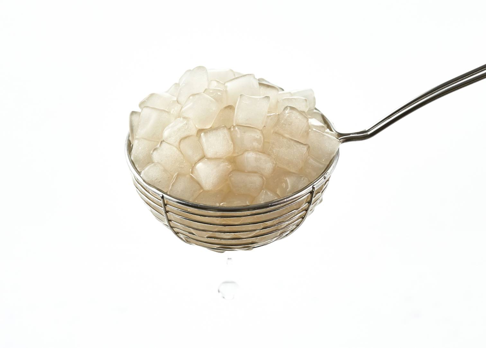
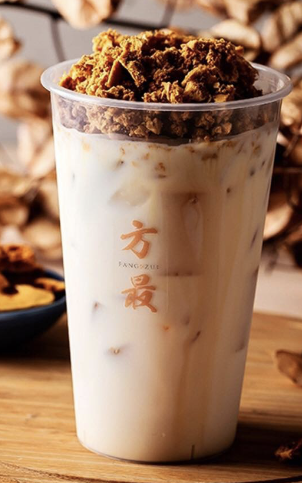

# Yu Dian Tea (御典茶) 
* Tags: `Kaohsiung limited` `not chain store`
* 🚩 [No. 38, Guyuan St, Gushan District, Kaohsiung City, Taiwan 804](https://maps.app.goo.gl/Hpo9ySXCJvo6mqrZ7)
* ⭐️ Monglia Milk Tea add TAPIOCA CUBE

The below img is TAPIOCA CUBE (粉角), which is their special. Super popular and had better go earlier to prevent sold out
* 
* It is in Kaohsiung, nearby Sun Yat-sen University. When I study in there it is the Top option for the student in our school.  Even after I move to Taipei and there are literally thunsands of Tea shop , Yu Dian Tea it still unreplacable.
* It is nearby MRT station and Sizihwan Bay. It is a good visited spot, you can go for a walk on the beach or hiking in Shoushan National Natural Park. 
 
# Fang Zui Artisan Tea (方最茗品) 
* Tags: `Taipei`
* 🚩 [No. 60-6號, Section 2, Jinan Rd, Zhongzheng District, Taipei City, Taiwan 100](https://maps.app.goo.gl/BV4nZ1RwWkuKpHE66)
* ⭐️ Honeycomb Toffee milk tea
* The topping, Honeycomb toffee, is sweet but also a little bitter and add special scent to the milk tea. My personal favorite after I move to Taipei.
* 
### OOlong Tea project(得正)
* Tags: `Chain store`, `Taichung`, `Taipei`
* ⭐️ light Roasted Oolong Tea Latte add Oolong tea jelly（輕烏龍鮮奶茶加烏龍茶凍） 
* Oolong Tea project is relatively new brand. Their menu is not special at all, but their tea quality is really good. They go viral in 2023.
# Spade Tea（十杯）
* Tags: `not Chain store` `Taipei` `Taichung` `Kaohsiung`
* ⭐️ Osmanthus fragrans milk tea （桂花清牧奶茶）
* Good tea and milk quality. My comfort food in Taipei
# Milksha（迷客夏） 
* Tags: `Chain store`
* ⭐️ Barley Water add Bubble(決明大麥加珍珠)
* ⭐️ Ice shavings of lemon Green Tea
# Ｍacu（麻古茶坊） 
* Tags: `Chain store`
* ⭐️ King of mango smoothie (楊枝甘露)
* ⭐️ Chi Chi mango smoothie（芝芝芒果果粒）
* ⭐️ Bo-Bo mango smoothie (波波芒果果粒)
[image](../images/2024-01-08-Best_Taiwan_Boba/mango_sip.jpg)

# Chain Store Taiwanese rank in 2023
1. KEBUKE Tea Co. 可不可熟成紅茶
1. WUSHILAND BOBA 五十嵐
1. chingshin 清心福全
1. Milksha 迷客夏
1. Taro Yuan 清原芋圓
1. DaYungs 大苑子
1. Tp Tea 茶湯會
1. Chun Shui Tang 春水堂
1. Presotea 鮮茶道
1. UNOCHA 烏弄
1. TRUEDAN 珍煮丹
1. COMEBUY
1. Like Tea Shop 老賴茶棧
1. Tea & Magic Han 茶之魔手
1. Hanlin Internatioal Enterprise 翰林茶館
1. Tea Shop 喫茶小舖
1. dont.yell.at.me 不要對我尖叫

